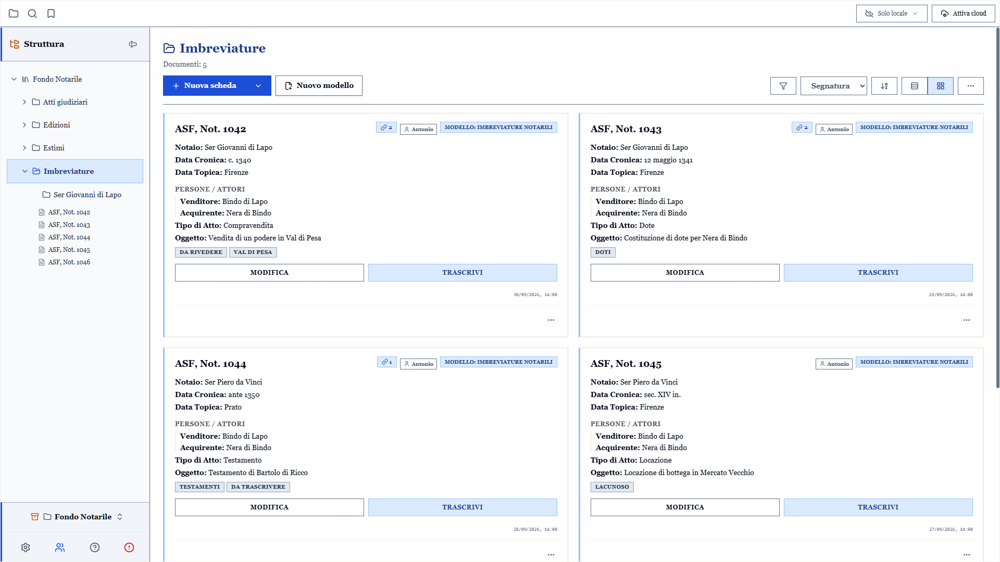
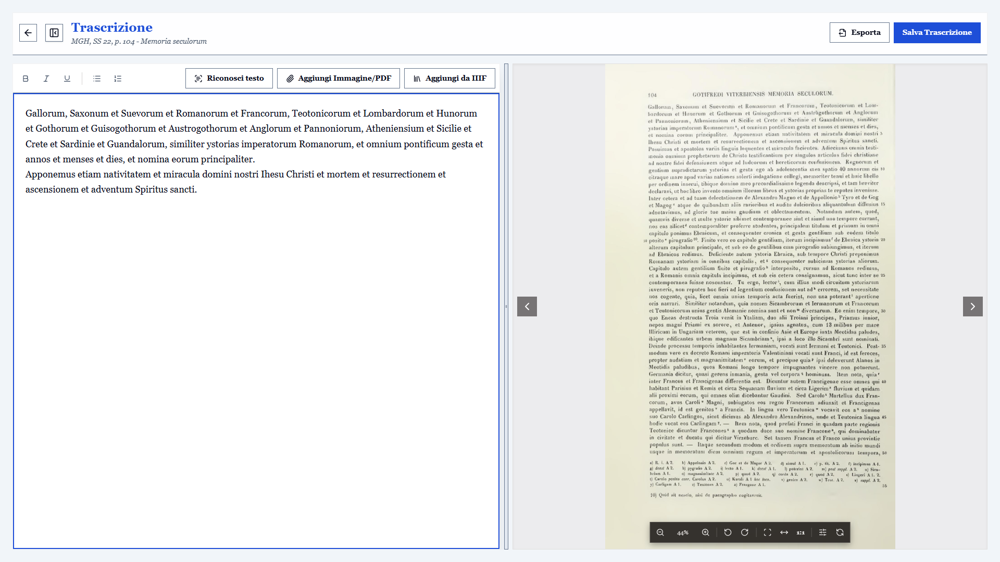
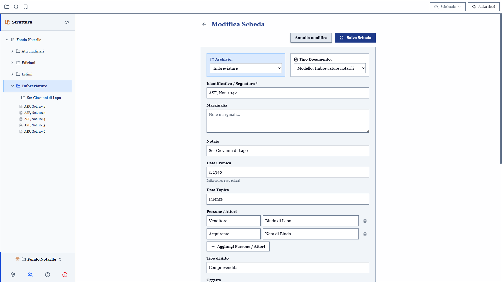
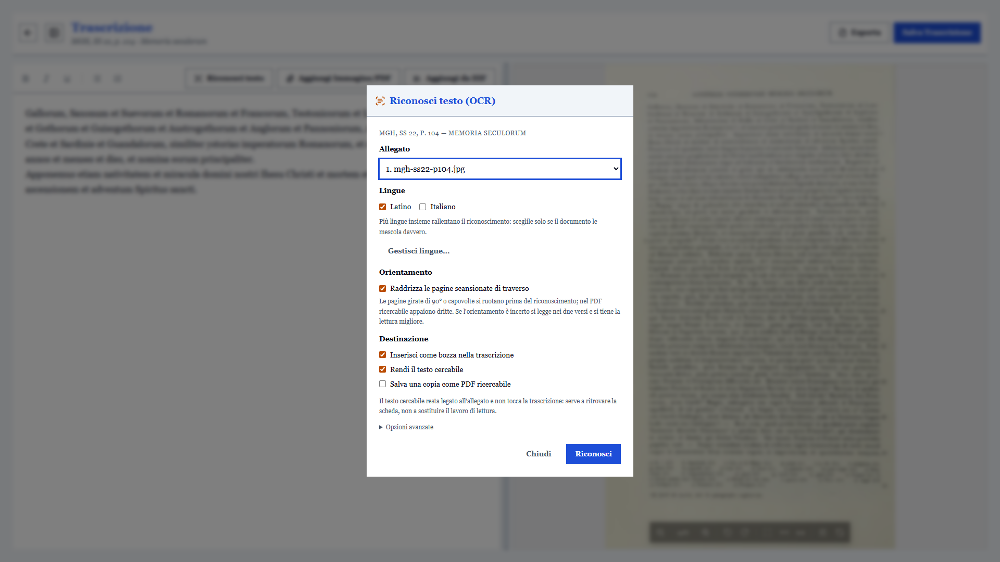
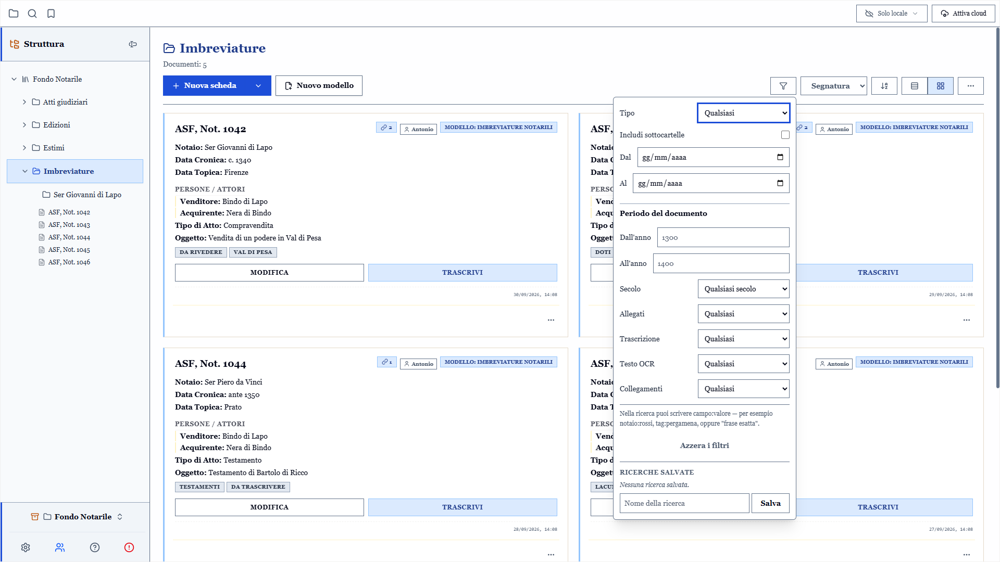
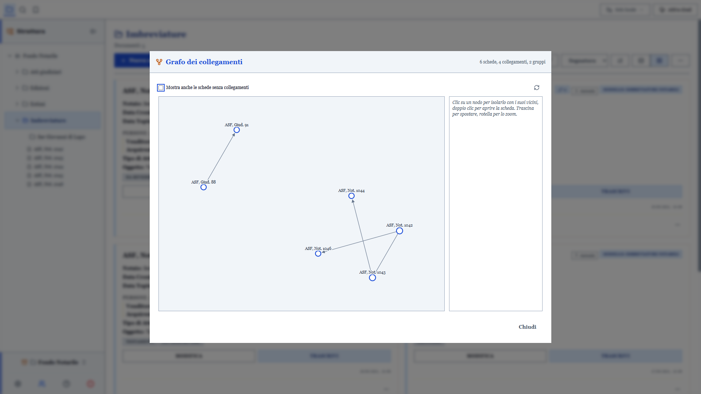
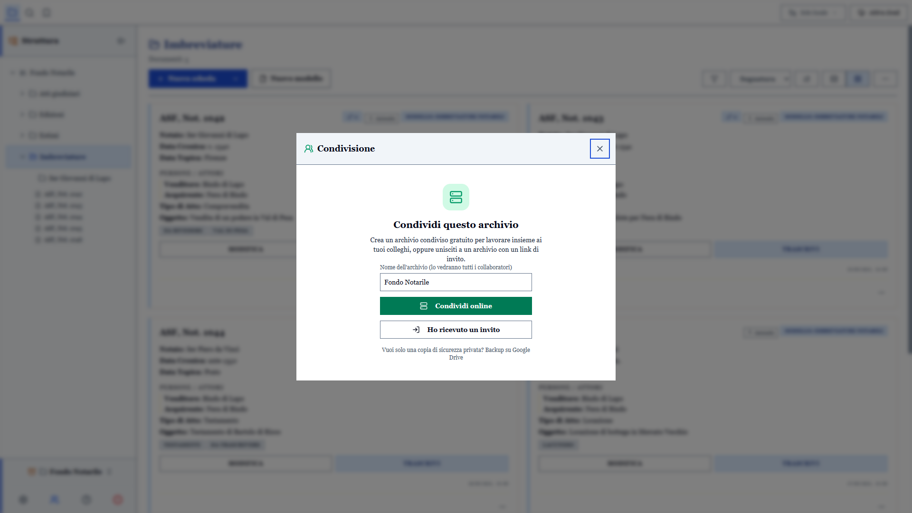
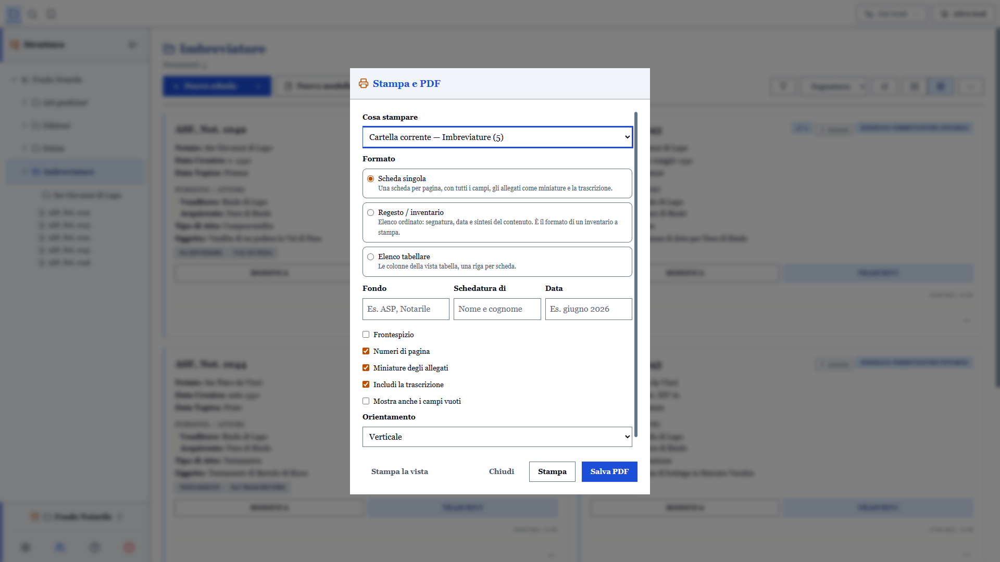

*Leggi in [Inglese](README.md)*

<picture>
  <source media="(prefers-color-scheme: dark)" srcset="docs/screenshots/it/vista-griglia-dark.png">
  
</picture>

# ArchiView

**ArchiView** è un'applicazione desktop (creata con Electron) progettata come gestionale offline per catalogare, archiviare e trascrivere manoscritti e documenti storici.

## Ambiente di Trascrizione Integrato

<picture>
  <source media="(prefers-color-scheme: dark)" srcset="docs/screenshots/it/trascrizione-dark.png">
  
</picture>

Un editor di testo con vista "split-screen" per affiancare comodamente le immagini o i PDF originali del documento durante il lavoro di trascrizione.

## Gestione Modulare dei Dati

<picture>
  <source media="(prefers-color-scheme: dark)" srcset="docs/screenshots/it/form-scheda-dark.png">
  
</picture>

Il cuore dell'applicazione si basa su un sistema di modelli di documento completamente dinamico. Puoi utilizzare i modelli predefiniti (Imbreviature notarili, Atti giudiziari, Documenti fiscali) o assemblare nuovi tipi di documento scegliendo solo i campi informativi di cui hai realmente bisogno (Titolo, Autori, Segnatura, Supporto, ecc.). L'interfaccia si adatterà automaticamente al modello scelto.

## Riconoscimento del Testo (OCR)

<picture>
  <source media="(prefers-color-scheme: dark)" srcset="docs/screenshots/it/ocr-dark.png">
  
</picture>

Riconosci il testo di scansioni e PDF interamente offline, con i pacchetti di lingua da installare solo quando servono. Il risultato può entrare nella trascrizione come bozza, oppure restare legato all'allegato come testo cercabile, per ritrovare la scheda. Il riconoscimento può anche salvare una copia dell'allegato come **PDF ricercabile**, e le pagine scansionate di traverso o capovolte vengono raddrizzate da sole.

## Ricerca, Filtri e Tag

<picture>
  <source media="(prefers-color-scheme: dark)" srcset="docs/screenshots/it/filtri-dark.png">
  
</picture>

Filtra l'archivio per tipo di documento, intervallo di date storiche o secolo, e secondo la presenza di allegati, trascrizione, testo OCR o collegamenti. La casella di ricerca accetta interrogazioni `campo:valore` (per esempio `notaio:rossi`, `tag:pergamena`) e frasi esatte, e le ricerche si possono salvare. I tag hanno un pannello proprio nella barra laterale, con il conteggio delle schede.

## Collegamenti e Grafo

<picture>
  <source media="(prefers-color-scheme: dark)" srcset="docs/screenshots/it/grafo-dark.png">
  
</picture>

Collega le schede fra loro con collegamenti tipizzati (atto collegato, copia di, e così via). Ogni scheda mostra le schede a cui rimanda e quelle che la citano. Il grafo dei collegamenti dà una vista d'insieme dell'archivio: un clic su un nodo lo isola con i suoi vicini, un doppio clic apre la scheda.

## Archivi Condivisi

<picture>
  <source media="(prefers-color-scheme: dark)" srcset="docs/screenshots/it/condivisione-dark.png">
  
</picture>

Crea gratuitamente un archivio condiviso e invita i colleghi con un link. Schede, trascrizioni e nome dell'archivio vengono cifrati prima di lasciare il computer, così il server non può leggerli. Quando qualcuno invia modifiche, gli altri membri ne sono avvisati subito. Se ti serve solo una copia privata, puoi invece fare il backup su Google Drive.

## Stampa ed Esportazione

<picture>
  <source media="(prefers-color-scheme: dark)" srcset="docs/screenshots/it/stampa-dark.png">
  
</picture>

Stampa una scheda, una cartella o l'intero archivio, o salvali in PDF, in tre formati: scheda singola con miniature e trascrizione, regesto/inventario come un inventario a stampa, oppure elenco tabellare, con frontespizio facoltativo. Le trascrizioni si esportano in HTML, Markdown o RTF (per Word e LibreOffice), le citazioni in BibTeX per LaTeX, Zotero e JabRef.

## Ulteriori Caratteristiche

- **Importazione Manifest IIIF**: Importa digitalizzazioni direttamente da biblioteche digitali come BnF/Gallica, e-codices, Biblioteca Apostolica Vaticana, British Library, Bodleian e da qualsiasi repository compatibile con lo standard IIIF Presentation (v2 e v3). Tutte le carte compaiono ordinate nel visualizzatore in streaming remoto, con cache offline LRU e possibilità di scaricarle in locale all'occorrenza per OCR e lavoro non in linea.
- **Esportazione e Stampa Complete**: Esporta le tue schede in Markdown (inclusi tutti i campi dinamici, campi personalizzati ed elenchi allegati), CSV o archivi ZIP completi di backup. Stampa le schede e le trascrizioni con anteprime e miniature anche per le carte IIIF.
- **Sincronizzazione tramite Server Hub (Nuova Architettura)**: Sincronizza e collabora in tempo reale con altri utenti tramite la nuova architettura basata interamente su un Server Hub ad alte prestazioni, che sostituisce il precedente modello Google Drive per i "Vault Condivisi". Puoi gestire archivi multipli e indipendenti (Multi-Vault) con risoluzione istantanea dei conflitti e sicurezza avanzata.
- **Tutorial Interattivo e Multilingua**: Impara ad utilizzare ArchiView grazie ad una guida interattiva integrata. L'applicazione è inoltre completamente tradotta in Italiano e in Inglese.
- **Organizzazione a Cartelle**: Gestisci i tuoi archivi in una struttura gerarchica di cartelle e sottocartelle per un ordine perfetto.
- **Gestione Allegati**: Allega e visualizza direttamente nell'applicazione scansioni, fotografie o file PDF associati alle tue schede.
- **Ricerca Avanzata e Tag**: Trova rapidamente qualsiasi scheda attraverso la ricerca globale testuale o filtrando l'archivio tramite i tag associati.
- **Formato Dati Aperto e Indipendente**: Nessun database proprietario o cloud bloccante (no vendor lock-in). Tutto il ciclo di vita dei dati avviene offline sul tuo dispositivo o tramite il tuo Server Hub. I documenti vengono salvati all'interno della cartella di lavoro (Workspace) in un formato JSON strutturato, chiaro, ispezionabile e facilmente manipolabile anche all'esterno dell'applicazione.
- **Esportabilità e Backup Immediato**: Hai il controllo totale e materiale dei tuoi dati. È sufficiente copiare la tua cartella Workspace su una chiavetta per trasferire l'intero progetto su un altro computer. Inoltre, è integrata una funzione nativa per generare in un solo clic l'intero archivio (database JSON e file allegati) in un pratico file ZIP di backup.

## Download e Installazione:

Il modo più semplice per utilizzare **ArchiView** è scaricare l'ultima versione:

1. Vai alla pagina [Releases](https://github.com/AntonioOrf/Schedatore/releases) del progetto su GitHub.
2. Scarica il file eseguibile per il tuo sistema operativo.
3. Avvia direttamente il file scaricato.

## Guida Utente (Wiki)

La guida completa all'uso — installazione, interfaccia, schede, trascrizione, ricerca, sincronizzazione e condivisione, esportazione e stampa, FAQ — è disponibile nella **[Wiki di ArchiView](https://archiview.web.app/wiki/)** (anche in [inglese](https://archiview.web.app/wiki/en/)).

---

## Per gli Sviluppatori (Compilazione da sorgente)

Se desideri modificare il codice o avviare l'applicazione in ambiente di sviluppo, assicurati di avere [Node.js](https://nodejs.org/) installato sul tuo sistema, quindi:

1. Clona questo repository o estrai i file del progetto.
2. Apri il terminale nella directory principale (dove si trova il file `package.json`).
3. Installa le dipendenze:
   ```bash
   npm install
   ```
4. Avvia l'applicazione:
   ```bash
   npm start
   ```

### Creazione dell'Eseguibile

Se desideri pacchettizzare l'applicazione per creare un eseguibile (es. per Windows):

```bash
npm run pack
```

Questo comando, grazie a `electron-builder`, creerà un pacchetto portable nella cartella `dist`.

## Primo Avvio

Al primo avvio, ArchiView ti chiederà di selezionare una **Cartella di Lavoro** (Workspace).
Scegli una directory vuota e sicura sul tuo disco fisso: al suo interno l'app creerà automaticamente:

- Il file `database_manoscritti.json` (dove verranno salvati tutti i testi e i metadati).
- La cartella `allegati_manoscritti` (dove verranno copiate le immagini e i PDF che allegherai alle schede).
  Puoi sempre modificare la cartella di lavoro successivamente dalle **Impostazioni**.

## Tecnologie Utilizzate

- [Electron](https://www.electronjs.org/) per il framework desktop.
- [Tailwind CSS](https://tailwindcss.com/) per lo styling dell'interfaccia.
- [Lucide Icons](https://lucide.dev/) per le icone.

## Privacy & Termini di Servizio

- [Privacy Policy](PRIVACY_POLICY.md)
- [Terms of Service](TERMS_OF_SERVICE.md)

## Licenza

Consulta il file [LICENSE](LICENSE) per ulteriori informazioni sulle condizioni d'uso.
