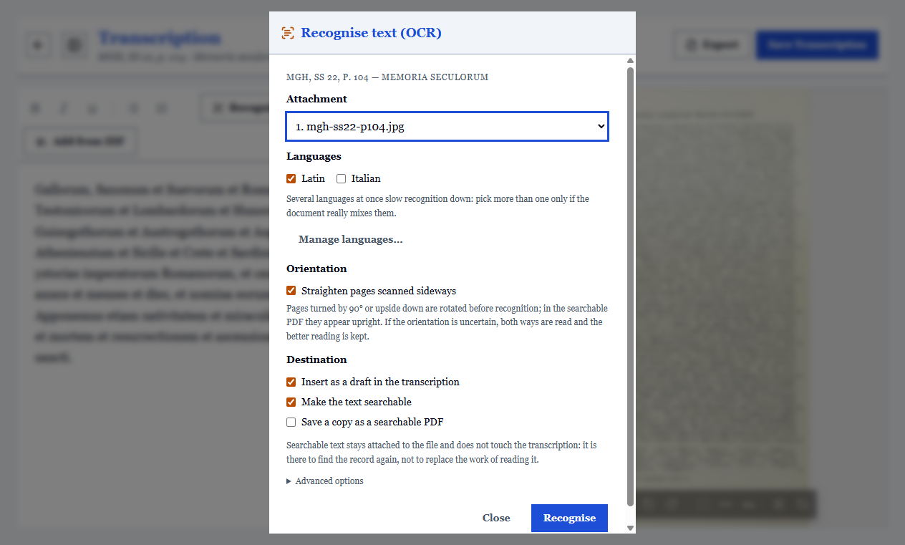
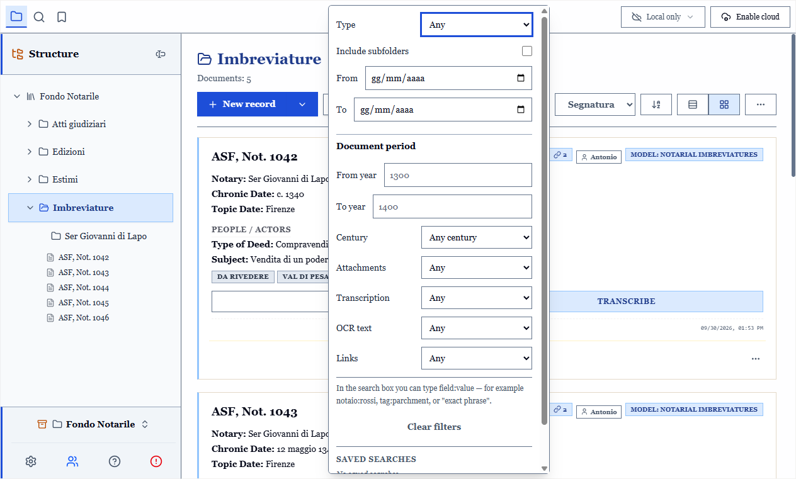
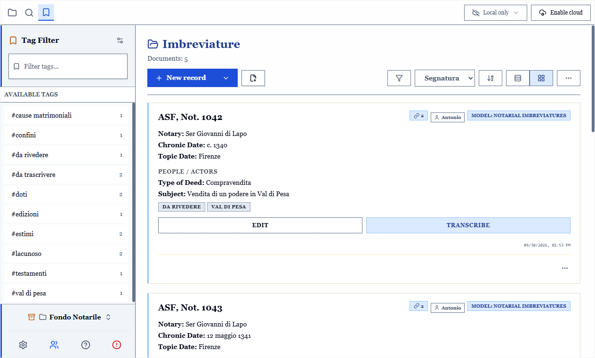
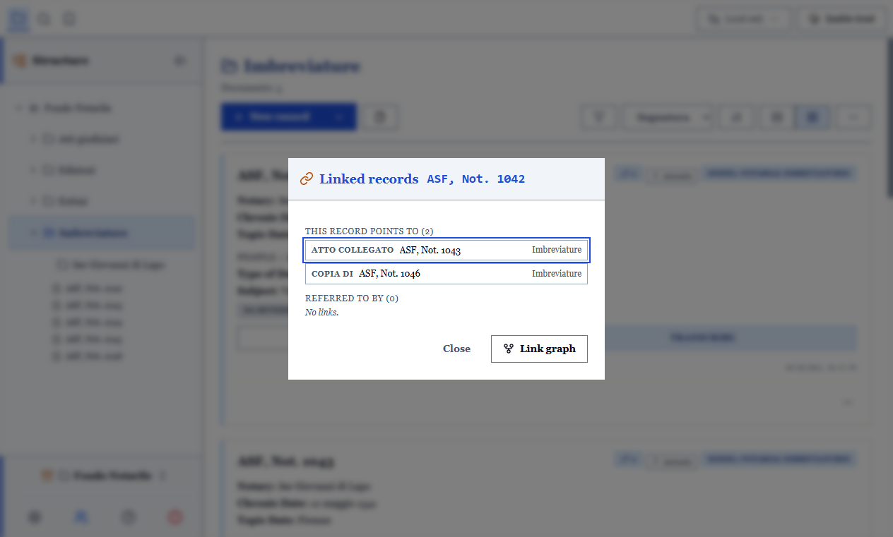
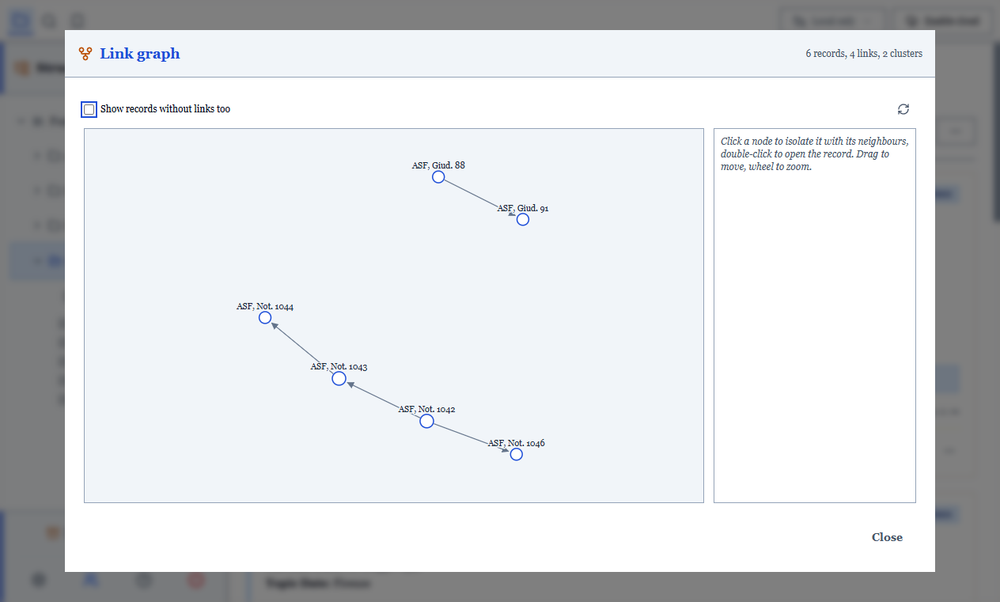
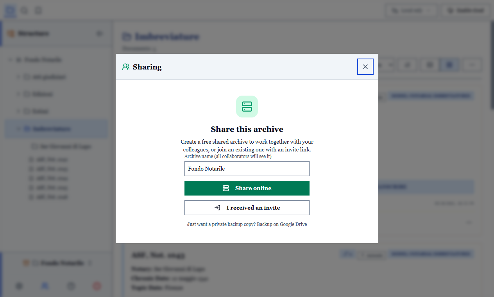
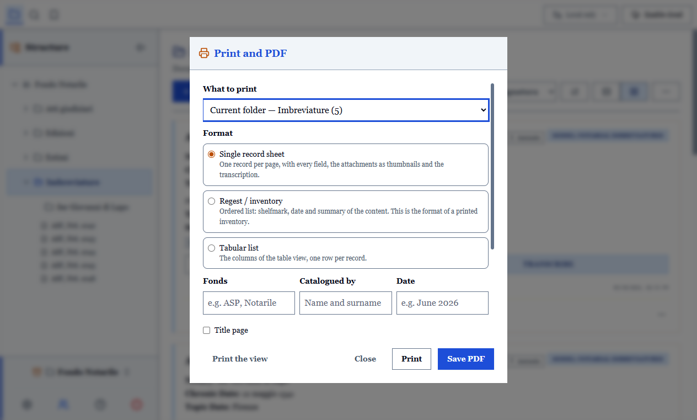
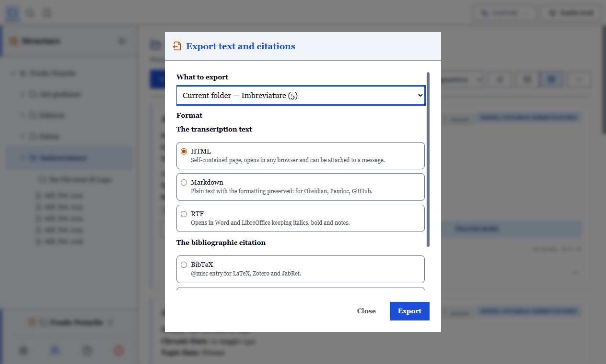

_Read this in [Italian](README-it.md)_


# ArchiView

**ArchiView** is a desktop application (built with Electron) designed as an offline management tool to catalog, archive, and transcribe manuscripts and historical documents.

## Integrated Transcription Environment


A text editor with a "split-screen" view to comfortably display the original images or PDFs of the document side-by-side during transcription work.

## Modular Data Management


The core of the application relies on a fully dynamic document template system. You can use predefined templates (Notarial deeds, Judicial acts, Tax documents) or assemble new document types by choosing only the data fields you actually need (Title, Authors, Shelfmark, Medium, etc.). The interface will automatically adapt to the chosen template.

## Text Recognition (OCR)

<picture>
  <source media="(prefers-color-scheme: dark)" srcset="docs/screenshots/en/ocr-dark.png">
  
</picture>

Recognise the text of scans and PDFs entirely offline, with language packs you install only when needed. The result can go into the transcription as a draft, or stay attached to the file as searchable text so you can find the record later. Recognition can also save a copy of the attachment as a **searchable PDF**, and pages scanned sideways or upside down are straightened automatically.

## Search, Filters and Tags

<table>
  <tr>
    <td width="50%">
      <picture>
        <source media="(prefers-color-scheme: dark)" srcset="docs/screenshots/en/filtri-dark.png">
        
      </picture>
    </td>
    <td width="50%">
      <picture>
        <source media="(prefers-color-scheme: dark)" srcset="docs/screenshots/en/tag-dark.png">
        
      </picture>
    </td>
  </tr>
</table>

Filter the archive by document type, historical date range or century, and by whether a record has attachments, a transcription, OCR text or links. The search box accepts `field:value` queries (for example `notaio:rossi`, `tag:parchment`) and exact phrases, and searches can be saved. Tags live in their own sidebar panel with a count for each tag.

## Linked Records and Graph

<table>
  <tr>
    <td width="50%">
      <picture>
        <source media="(prefers-color-scheme: dark)" srcset="docs/screenshots/en/collegamenti-dark.png">
        
      </picture>
    </td>
    <td width="50%">
      <picture>
        <source media="(prefers-color-scheme: dark)" srcset="docs/screenshots/en/grafo-dark.png">
        
      </picture>
    </td>
  </tr>
</table>

Connect records to one another with typed links (a related deed, a copy of, and so on). Each record lists the records it points to and the ones that refer to it. The link graph gives an overview of the whole archive: click a node to isolate it with its neighbours, and double-click it to open the record.

## Shared Archives

<picture>
  <source media="(prefers-color-scheme: dark)" srcset="docs/screenshots/en/condivisione-dark.png">
  
</picture>

Create a free shared archive and invite colleagues with a link. Records, transcriptions and the archive name are encrypted before they leave your computer, so the server cannot read them. Other members are notified as soon as someone sends changes. If you only want a private backup, you can back the archive up to Google Drive instead.

## Print and Export

<table>
  <tr>
    <td width="50%">
      <picture>
        <source media="(prefers-color-scheme: dark)" srcset="docs/screenshots/en/stampa-dark.png">
        
      </picture>
    </td>
    <td width="50%">
      <picture>
        <source media="(prefers-color-scheme: dark)" srcset="docs/screenshots/en/esporta-testo-dark.png">
        
      </picture>
    </td>
  </tr>
</table>

Print a record, a folder or the whole archive, or save it as a PDF, in one of three layouts: a full record sheet with thumbnails and transcription, a regest/inventory like a printed finding aid, or a tabular list, with an optional title page. Transcriptions can be exported as HTML, Markdown or RTF (for Word and LibreOffice), and citations as BibTeX for LaTeX, Zotero and JabRef.

## Additional Features

- **IIIF Manifest Import**: Directly import digitized manuscripts from BnF/Gallica, e-codices, Vatican Library, British Library, Bodleian, and any library supporting the IIIF Presentation standard (v2 and v3). Browse folios immediately with remote streaming, offline LRU caching, and on-demand local downloading for OCR and offline use.
- **Flexible Export & Print**: Export records to Markdown (including all dynamic fields, custom fields, and attachment lists), CSV, or standalone backup ZIP archives. Print comprehensive record sheets and transcriptions with thumbnail support for local and IIIF remote folios.
- **Hub Server Synchronization (New Architecture)**: Synchronize and collaborate in real-time with other users via the new Hub Server architecture, which replaces the legacy Google Drive model for "Shared Vaults". You can manage multiple independent Archives (Multi-Vault) with instant conflict resolution and native security.
- **Interactive Tutorial & Multi-language**: Learn how to use ArchiView with a built-in interactive guide. The application is fully translated in English and Italian.
- **Folder Organization**: Manage your archives in a hierarchical structure of folders and subfolders for perfect organization.
- **Attachment Management**: Attach and view scans, photographs, or PDF files associated with your records directly within the application.
- **Advanced Search and Tags**: Quickly find any record through global text search or by filtering the archive via associated tags.
- **Open and Independent Data Format**: No proprietary databases or cloud lock-in (no vendor lock-in). The entire data lifecycle takes place offline on your device, or securely synced via your Hub server. Documents are saved within your Workspace folder in a structured JSON format, which is clear, inspectable, and easily manipulable even outside the application.
- **Portability and Instant Backup**: You have total and material control over your data. Simply copy your Workspace folder to a USB drive to transfer the entire project to another computer. Additionally, a native feature is integrated to generate your entire archive (JSON database and attached files) into a convenient backup ZIP file with a single click.

## Download and Installation:

The easiest way to use **ArchiView** is to download the latest release:

1. Go to the [Releases](https://github.com/AntonioOrf/Schedatore/releases) page of the project on GitHub.
2. Download the executable file for your operating system.
3. Run the downloaded file directly.

## User Guide (Wiki)

The complete user guide — installation, interface, records, transcription, search, sync and sharing, export and print, FAQ — is available in the **[ArchiView Wiki](https://archiview.web.app/wiki/en/)** (also in [Italian](https://archiview.web.app/wiki/)).

---

## For Developers (Building from source)

If you want to modify the code or run the application in a development environment, make sure you have [Node.js](https://nodejs.org/) installed on your system, then:

1. Clone this repository or extract the project files.
2. Open the terminal in the root directory (where the `package.json` file is located).
3. Install the dependencies:
   ```bash
   npm install
   ```
4. Start the application:
   ```bash
   npm start
   ```

### Creating the Executable

If you want to package the application to create an executable (e.g., for Windows):

```bash
npm run pack
```

This command, thanks to `electron-builder`, will create a portable package in the `dist` folder.

## First Launch

Upon first launch, ArchiView will ask you to select a **Workspace** folder.
Choose an empty and safe directory on your hard drive: inside it, the app will automatically create:

- The `database_manoscritti.json` file (where all texts and metadata will be saved).
- The `allegati_manoscritti` folder (where images and PDFs you attach to your records will be copied).
  You can always change the workspace folder later from the **Settings**.

## Technologies Used

- [Electron](https://www.electronjs.org/) for the desktop framework.
- [Tailwind CSS](https://tailwindcss.com/) for UI styling.
- [Lucide Icons](https://lucide.dev/) for icons.

## Legal & Privacy

- [Privacy Policy](PRIVACY_POLICY.md)
- [Terms of Service](TERMS_OF_SERVICE.md)

## License

See the [LICENSE](LICENSE) file for more information on the terms of use.
